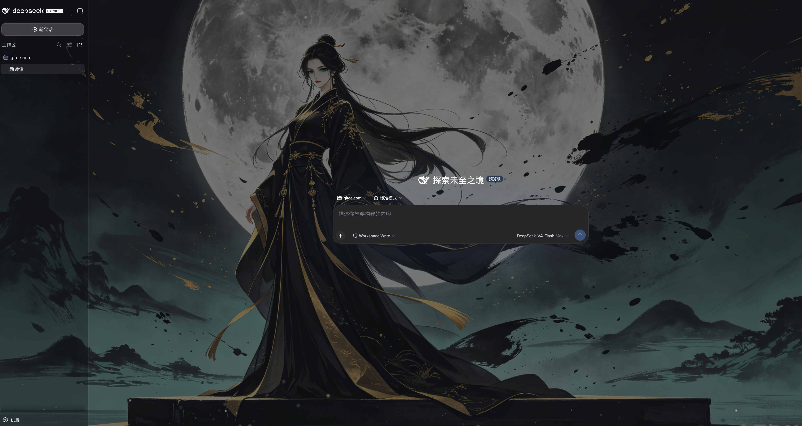
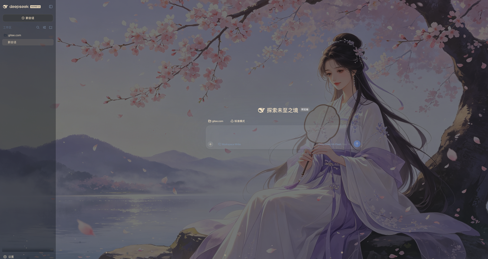
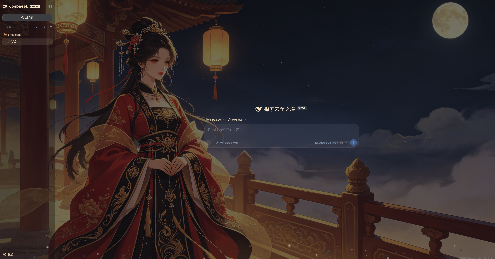
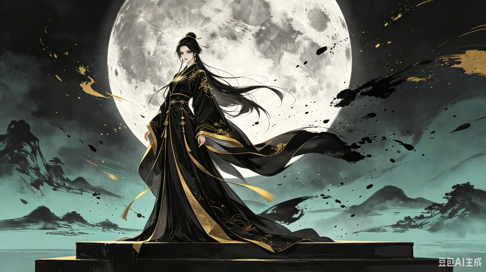
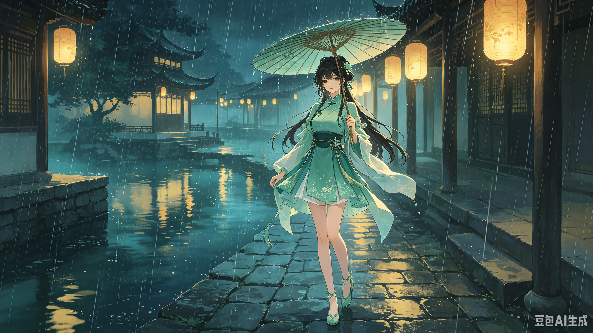

<p align="center">
  <strong>中文</strong> · <a href="./docs/i18n/README.en.md">English</a> · <a href="./docs/i18n/README.ja.md">日本語</a> · <a href="./docs/i18n/README.ko.md">한국어</a> · <a href="./docs/i18n/README.es.md">Español</a> · <a href="./docs/i18n/README.fr.md">Français</a> · <a href="./docs/i18n/README.de.md">Deutsch</a> · <a href="./docs/i18n/README.ru.md">Русский</a>
</p>

<div align="center">

# 墨韵 · MoYun 🖌️

**为 DeepSeek Harness 换上一袭水墨意境的东方之美。**

中国水墨画风格主题 · 自定义壁纸 · 粒子特效 · 全语言支持 —— 一条 `--dsw-*` token 生态内的优雅实现。装一次，用很久。

> **水墨丹青，意境悠远。写代码的地方，也可以有诗意。**

| 🏔️ 5 套水墨主题 | 🖼️ 自定义壁纸 + 模糊 | 🌊 粒子飘落特效 | 🌏 8 种语言支持 |
|---|---|---|---|

> 1 行安装 · 纯原生（无注入/不改安装包）· 不因 DSH 更新失效

</div>

---

## 🎮 两种玩法，一条插件都给你

<table>
  <tr>
    <td align="center" width="50%"><h3>🪄 玩法一：开箱即用的意境</h3></td>
    <td align="center" width="50%"><h3>🧱 玩法二：随你掌控的写意</h3></td>
  </tr>
  <tr>
    <td>内置 <b>5 套原创水墨主题</b>（墨韵系列），每套自带专属水墨意境。<br/><b>戴上即雅致，不用任何调参。</b></td>
    <td>在预设之上，你还能 <b>上传自定义壁纸</b>、<b>调节背景模糊与透明度</b>、<b>开关墨点粒子特效</b>。<br/><b>想要的意境，自己画。</b></td>
  </tr>
</table>

两种玩法分层独立、互不干扰：预设主题决定「意境与底色」，自定义一层是纯叠加（`overrideTokens`），随开随关、一键还原。

---

## 📸 实机截图

> 真机效果，非概念图。水墨主题应用于 DSH 界面，东方意境与现代工具的融合。

<p align="center">
  
  
  
</p>

---

## 🎨 预览 — 墨韵系列

> **玩法一 · 开箱即用的意境。** 5 套水墨主题，由各主题的**真实 token + 意境背景**生成——所见即所得。点开可放大查看。

<table>
  <tr>
    <td align="center"><a href="docs/previews/pine.png"></a><br/><b>远山孤松</b> · 远山淡影，苍松独立</td>
    <td align="center"><a href="docs/previews/jiangnan.png"></a><br/><b>烟雨江南</b> · 水乡烟雨，灯影朦胧</td>
    <td align="center"><a href="docs/previews/bamboo.png"></a><br/><b>竹影清风</b> · 翠竹摇曳，清风徐来</td>
  </tr>
  <tr>
    <td align="center"><a href="docs/previews/plum.png"></a><br/><b>梅傲霜雪</b> · 梅花傲雪，枝干虬曲</td>
    <td align="center"><a href="docs/previews/landscape.png"></a><br/><b>山水留白</b> · 留白写意，远山孤亭</td>
    <td align="center"></td>
  </tr>
</table>

### 📋 主题一览

| ID | 主题 | 意境 |
|------|-------|------|
| `01` 远山孤松 | 🌲 苍松独立 | 远山淡影，苍松独立 |
| `02` 烟雨江南 | 🏮 灯影朦胧 | 水乡烟雨，灯影朦胧 |
| `03` 竹影清风 | 🎋 清风徐来 | 翠竹摇曳，清风徐来 |
| `04` 梅傲霜雪 | 🌸 傲雪寒梅 | 梅花傲雪，枝干虬曲 |
| `05` 山水留白 | 🏔️ 写意留白 | 留白写意，远山孤亭 |

---

## 🧱 强大自定义空间（玩法二）

> 预设主题之外，墨韵还给你一套完整的自定义体系——想要独一无二的水墨意境，从这里开始。

| 能力 | 玩法二 · 你能做什么 |
|------|------|
| 🖼️ **自定义壁纸** | 本地图片上传（PNG / JPG，自动压缩优化），每张主题自动保存专属壁纸 |
| 🎚️ **背景模糊** | 滑块调节壁纸模糊程度，从锐利到朦胧随心掌控 |
| 🌫️ **背景透明度** | 控制壁纸与主题色的融合程度，淡雅或浓烈一键切换 |
| 🌊 **粒子特效** | 墨点纷飞的粒子动画，密度可调，让画面灵动起来 |
| ↩️ **一键还原** | 随时回到预设主题或 DSH 内置外观，大胆尝试无后顾之忧 |
| 🌏 **8 种语言** | 中文 / English / 日本語 / 한국어 / Español / Français / Deutsch / РусSKY，跟随系统自动切换 |

> 一切都叠加在预设之上，**随开随关、一键还原**到 DSH 内置外观——大胆去试，不会弄坏什么。

---

## ⚡ 一句话安装

**复制下面这句话给你的 DSH，它自己会装好一切：**

> 请帮我安装 dsh-web-theme 墨韵水墨主题插件（https://github.com/RevolutionLA/dsh-web-theme 或 npm 的 dsh-web-theme），装完告诉我如何重启 DSH Web。

不想麻烦 Agent？命令行一条：

```sh
dsh plugin --profile web add dsh-web-theme && dsh web
```

> 🚀 **现已发布到 npm！** 装好 DSH 后，一条命令即可安装，无需 clone。
>
> **致敬 `https://github.com/RevolutionLA/dsh-dream-skin` 。** 借鉴其插件架构与设计理念，但专注于中国水墨画风格与东方美学。

---

## 🏆 为什么值得用（vs 同类）

> 换个赛道看：同类插件把换肤做成二次元题材的「贴图墙」；我们把换肤做成**水墨意境与东方美学的精细化表达**——
> 追求的不是「更花」，而是「更雅、更远、更耐看」，像一幅反复推敲的水墨画。**意境是我们的护城河。**

| 能力 | 本插件（墨韵） | 同类换肤方案 |
|------|:---:|:---:|
| 原生 token 主题，不注入、不改安装包 | ✅ | ✅ |
| **中国水墨画风格（水墨 / 写意 / 留白）** | ✅ | ❌ |
| **墨点粒子飘落特效** | ✅ | ❌ |
| 自定义壁纸 + 模糊 / 透明度控制 | ✅ | 部分 |
| **8 种语言国际化（含日韩英法德西俄）** | ✅ | 部分 |
| **DSH 原生设置面板集成** | ✅ | ❌ |
| 浏览器 Web GUI，天然跨平台 | ✅ | ✅ |

---

## ✨ 功能一览

| 能力 | 说明 |
|------|------|
| 🏔️ **5 套水墨主题预设** | 在 **设置 → 主题** 一键切换，暗色 / 意境兼顾 |
| 🖼️ **自定义壁纸** | 上传本地图（自动压缩优化），调节**模糊 / 透明度** |
| 🌊 **墨点粒子** | 飘动的墨点、雨珠、微光粒子，营造灵动氛围 |
| ↩️ **默认还原** | 一键回到 DSH 内置外观（跟随系统） |
| 💾 **本地持久化** | 主题与壁纸存 IndexedDB，刷新 / 重开浏览器不丢 |
| 🎚️ **模糊 & 透明度** | 独立滑块控制壁纸的模糊与透明，随心调参 |
| 🌏 **8 种语言** | 中文 / English / 日本語 / 한국어 / Español / Français / Deutsch / РусSKY |

---

## 🧩 它是什么形式的插件

**它是 DeepSeek Harness 的标准「双面插件」（`dsh-plugin`）——加载和用法与官方 `ui-theme` 完全一致。**

DeepSeek Harness 的口号是「一切皆插件」：模型、工具、沙箱、会话、UI，乃至 Agent Loop 本身都是插件。
`dsh-web-theme` 的本质就是把「水墨换肤」做成一个和官方 UI 包**同构**的 npm 包：

```text
            ┌────────────── dsh-web-theme（标准 dsh-plugin / 双面插件）──────────────┐
            │  dsh.bundle   → cordis.patch.yml 插入 dsh-web-theme 入口   (host 半边)     │
            │  dsh.client   → client/client.js（浏览器 bundle）          (浏览器半边)     │
            └─────────────────────────────────────────────────────────────────────────┘
```

- **安装命令 = 官方唯一安装命令**：`dsh plugin --profile web add dsh-web-theme`
- **调用的是官方扩展点**：`ctx.theme`（注册主题）、`ctx.theme.overrideTokens`（叠加层）、
  `ctx.slots`（把 UI 挂进独立的 **设置 → 主题** 分节）。
- **manifest 契约与官方一致**：`dsh.bundle` + `dsh.client` + `exports["./client"]`。

也就是说：**你装的不是一个旁门左道的脚本，而是 DSH 官方插件体系里的标准主题插件。**

---

## ⚡ 快速开始（3 步）

```sh
# 1. 安装
dsh plugin --profile web add dsh-web-theme
# 2. 重启
dsh web
# 3. 打开 设置 → 主题 → 挑一套水墨意境 → 完。
```

> 装的是 npm 已完成发布的正式包，无需 clone。若 `dsh plugin add` 报 workspace 相关错误，补一个 `-w` 即可。

## 📦 安装

四种方式任选其一，装完**重启 DSH Web** 即生效（当前会话会中断，但 DSH 会话有磁盘持久化，重启后可以恢复）。

### 方式一：npm 正式包（**推荐**，最简单）

```sh
dsh plugin --profile web add dsh-web-theme
```

### 方式二：从 GitHub 安装

```sh
dsh plugin --profile web add 'github:RevolutionLA/dsh-web-theme'
```

### 方式三：克隆后从本地路径安装（开发迭代）

```sh
git clone https://github.com/RevolutionLA/dsh-web-theme.git
cd dsh-web-theme
dsh plugin --profile web add .
```

> `dsh plugin` 会把相对路径锚定到你**运行命令的目录**，装的是指向克隆目录的 link 依赖：改完源码保存，重启 DSH 即生效，无需重新安装。

**重启并验证**：

```sh
dsh web
dsh --profile web --dump-config | grep -A2 dsh-web-theme   # 应出现 dsh-web-theme loader 条目
```

打开 **设置 → 主题**，即可看到「预设主题」「自定义图片」「模糊 / 透明度」与「粒子特效」等选项。

> `-w` 标志在裸 `add` 时必需：每个 profile 自带 `pnpm-workspace.yaml`，pnpm 会把它当作 workspace 根，裸加报错
> `ERR_PNPM_ADDING_TO_ROOT`。若已加过 `-w`，后续用现有 workspace 即无需重复。

---

## 🔄 更新 / 卸载

**更新到最新版**（装的是 npm 正式包时）：

```sh
dsh plugin --profile web update dsh-web-theme
dsh web   # 重启生效
```

**卸载**：

```sh
dsh plugin --profile web remove dsh-web-theme
dsh web   # 重启后恢复官方外观
```

---

## 🧩 兼容性

| 项 | 值 |
|------|-----|
| DeepSeek Harness (`dsh`) | `0.1.0-rc.6+`（peerDependencies 以 `^0.1.0-rc.6` 对齐） |
| Node.js | `>=18` |
| 浏览器 | 现代 Chromium / WebKit（依赖原生 CSS 变量与 `matchMedia`） |

> 升级 DSH 到新版本时，请同步更新 `package.json` 里的 peerDependencies。

---

## ⚙️ 工作原理

DSH 的主题系统是 token 化的：web 外壳内置 `--dsw-*` 设计令牌，`ThemeRuntime` 允许第三方插件注册主题去
覆盖别名层（`--dsw-alias-*`）。本插件是标准的「双面」插件：

```text
                ┌─────────────────────────────────────────────┐
                │            dsh-web-theme (双面插件)          │
                ├────────────────────────────┬────────────────┤
    Host 半边   │  src/index.ts               │  浏览器半边      │
                │  cordis.patch.yml 插入      │  client/client.js │
                │  dsh-web-theme loader 入口  │  __ModuleLoader__│
                └────────────────────────────┴────────────────┘
                             │                         │
                        profile 树加载              /plugins/dsh-web-theme/client.js
                                                          │
        ┌────────────────────────────────┬────────────────┐
        │                                │                │
   ctx.theme.register(5套主题)      ctx.theme.overrideTokens(壁纸半透明)   ctx.slots.inject('settings.section' + 'settings.moyun.item')
```

- **Host 半边**（`src/index.ts`）：`dsh.bundle` patch 层，插入 `dsh-web-theme` loader 入口；同时注册主题图片 API 路由（`/api/dsh-web-theme/themes/*.png`）供浏览器端预览图加载。
- **浏览器半边**（`client/client.js`）：
  1. `ctx.theme.register(...)` 注册 5 套水墨主题的 tokens；
  2. 恢复上次保存的主题并 `ctx.theme.setTheme(...)` 应用；
  3. 壁纸渲染为 `z-index:-1` 固定背景层，叠加 `ctx.theme.overrideTokens(...)` 让主画布与侧边栏半透明；
  4. 监听 `theme/change`，切主题 / 深浅色时自动重新着色壁纸；
  5. 墨点粒子动画层，密度可调；
  6. 注册独立的 **设置 → 主题** 分节（`settings.section`），功能行挂在 `settings.moyun.item` 插槽下。

每套主题携带自己的 `colorScheme`（`dark`），驱动 `body[data-ds-dark-theme]`；别名 token 覆盖作为
`<body>` 内联自定义属性由 ui-layout 的 ThemePresenter 应用。

---

## 💼 持久化说明

- 主题选择存于 `localStorage`（键前缀 `dsh-web-theme:`），**只在当前浏览器生效**。
- 自定义壁纸存储于 IndexedDB（`dsh-web-theme-db` / `images` 仓库），支持大图持久化。
- 设置（模糊、透明度、粒子密度等）通过 DSH Host settings API 同步，跨浏览器标签页共享。
- 为何不用单一存储？壁纸图片可能数 MB，IndexedDB 更适合大图存储；偏好设置用 localStorage 读写更快。

---

## 🛠️ 开发 / 扩展

客户端 bundle 直接以 `__ModuleLoader__` 格式编写（即 tsdown 为官方 `ui-*` 包输出的形态），**免构建**。
`client/client.js` 只能 `require` 模块表实体：平台种子词（`react`、`react/jsx-runtime`、…）与已注册客户端
bundle（`@deepseek-ai/dsh-client-runtime/client`、…）。

- **新增一套内置主题**：在 `client/themes.js` 的 `THEMES` 数组加一个对象（`id` + `name` + `description` + `tokens`），
  它即自动出现在设置里；记得在**全部 8 种语言词典**（`client/i18n.js`）补对应文案。
- **放你自己的壁纸**：把图片丢进 [`themes/`](./themes/) 目录（注意只在你有权限的前提下分发），再在
  DSH 的「自定义图片」里导入即可。
- **编译 TypeScript**：`npm run build` 编译宿主端代码到 `dist/`。
- **开发模式**：`npm run dev` 监听 TypeScript 变更自动编译，另开一个终端 `dsh web` 启动服务。

---

## 📌 Roadmap

- [x] 首版：5 套水墨主题 + 自定义壁纸（模糊 / 透明度）+ 本地持久化
- [x] 墨点粒子特效（密度可调）
- [x] 8 种语言国际化
- [x] DSH 原生设置面板集成（dsh-settings 注册）
- [ ] 更多水墨主题（四季系列、山水长卷等）
- [ ] 在线主题 Studio（浏览器内调色 + 实时预览）
- [ ] 首帧无闪烁（FOUC）改进
- [ ] 社区主题投稿与分享

---

## 🤝 贡献

欢迎提交 Issue 与 PR！请先阅读 [贡献指南](./CONTRIBUTING.md)。

## ⭐ 支持这个项目

喜欢的话，给仓库点个 **Star ⭐**、在 npm 上点个 **👍**，或把它转发给你的 DSH 朋友——这会让更多人发现它，
也能激励持续维护。

## 🔒 安全

发现安全问题？请勿直接开公开 Issue。

## 📄 开源协议

[MIT](./LICENSE)

## 🙏 致谢

- 架构与 API 参考：DeepSeek Harness 官方
  `https://github.com/deepseek-ai/deepseek-harness/tree/master/packages/client/ui-theme` 客户端包。
- 设计理念与插件架构参考：`https://github.com/RevolutionLA/dsh-dream-skin` 。
- 主题意境灵感：中国传统水墨画（宋画、元画意境）。

## 📈 成长曲线

> 发布后每天自动更新（GitHub Actions）。下载量来自 npm 公共 API。

<p align="center">
  
</p>

<p align="center" style="display:none">
  <em>📊 发布后此处将展示下载量曲线图</em>
</p>
*数据来自 `https://api.npmjs.org/downloads/point/last-month/dsh-web-theme` 。*
